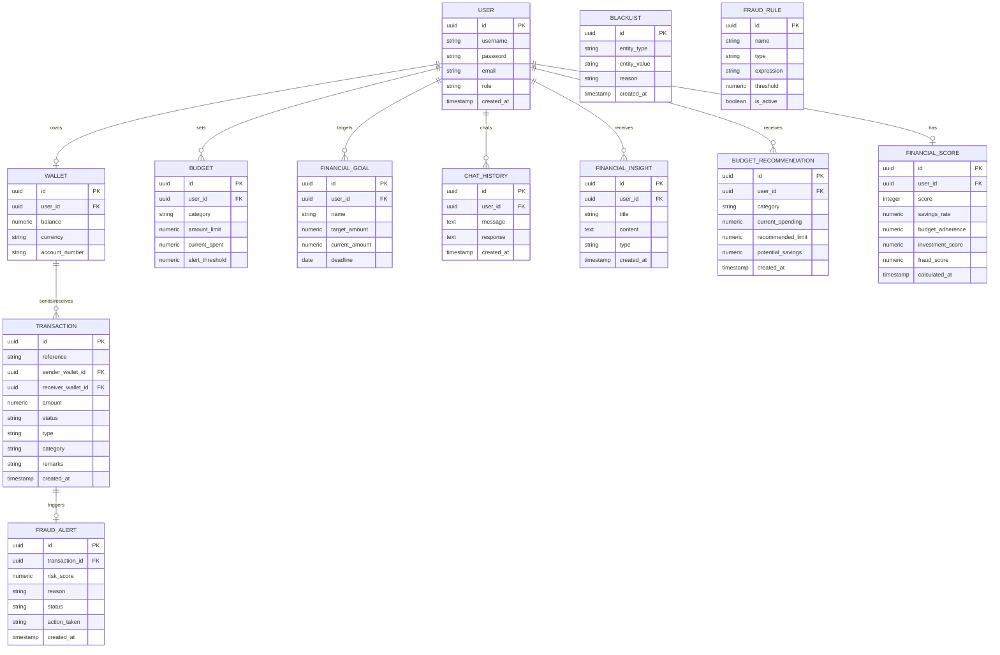

# Entity-Relationship (ER) Diagram

The following diagram illustrates the PostgreSQL database schema for the ApexPay payment platform, depicting the relationships between authentication, wallet engine, transaction log, fraud risk engine, and the AI financial assistant.

