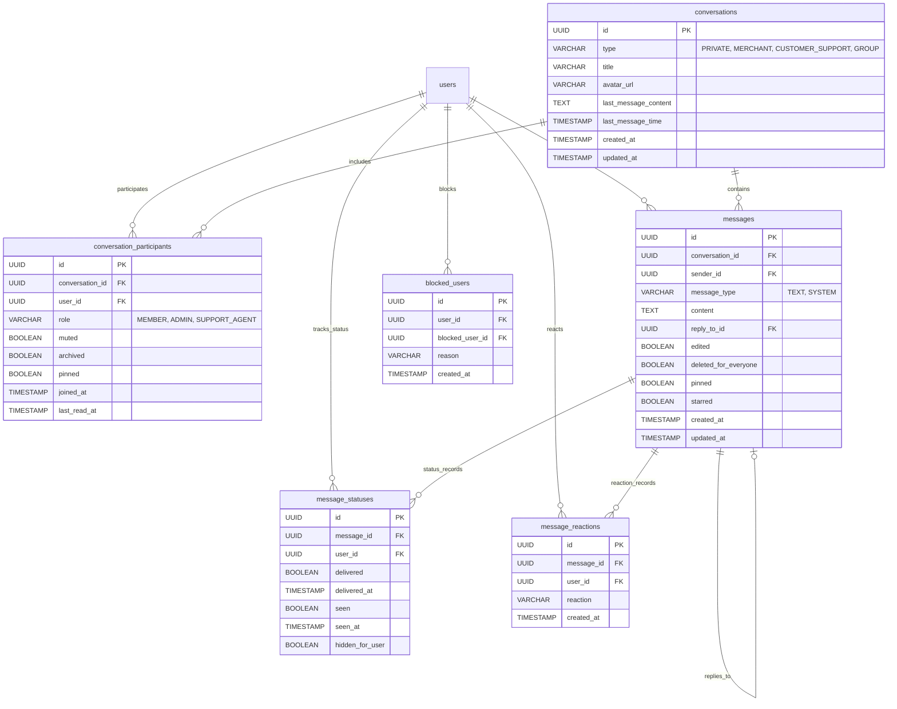
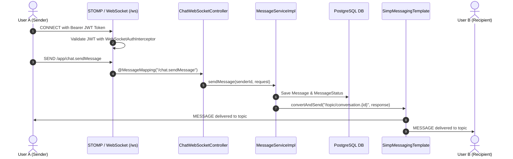
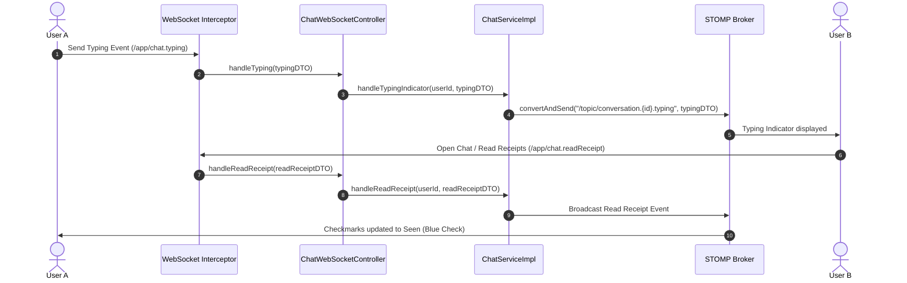
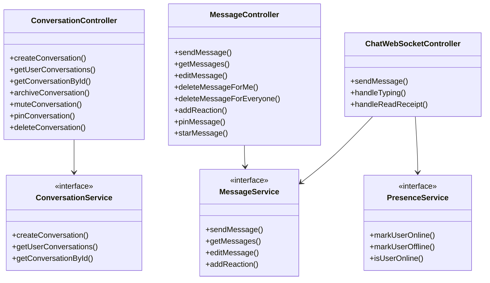

# ApexPay Module 16 – Real-Time Chat & Messaging Architecture

This document presents the detailed architectural specifications, ER diagrams, sequence diagrams, and class diagrams for Module 16: **Real-Time Chat & Messaging Platform**.

---

## 1. Entity-Relationship (ER) Diagram

---

## 2. Real-Time WebSockets Architecture

---

## 3. Sequence Diagram – Typing Indicator & Read Receipts

---

## 4. Class Diagram

