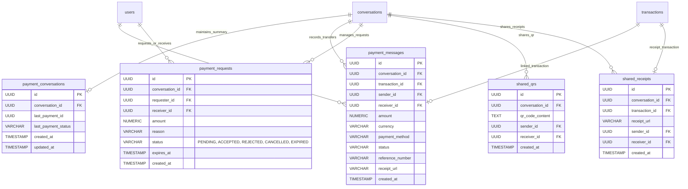
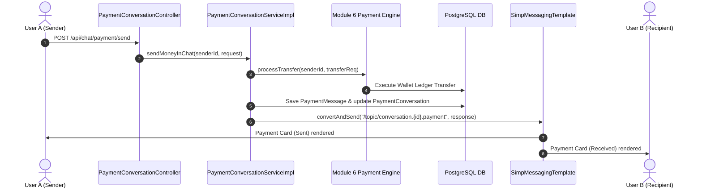
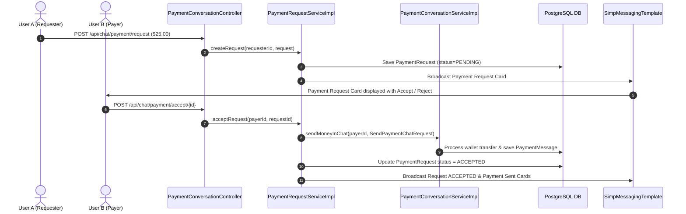

# ApexPay Module 17 – Payment Conversations & Financial Messaging Architecture

This document presents the detailed architectural specifications, ER diagrams, sequence diagrams, and class diagrams for Module 17: **Payment Conversations & Financial Messaging**.

---

## 1. Entity-Relationship (ER) Diagram

---

## 2. Payment Execution & Real-Time Flow

---

## 3. Money Request & Accept Sequence

