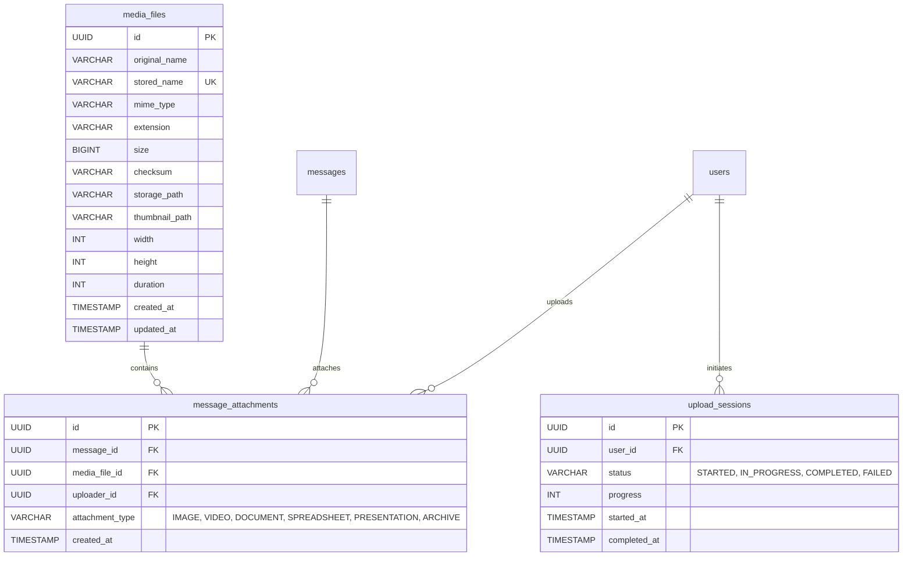
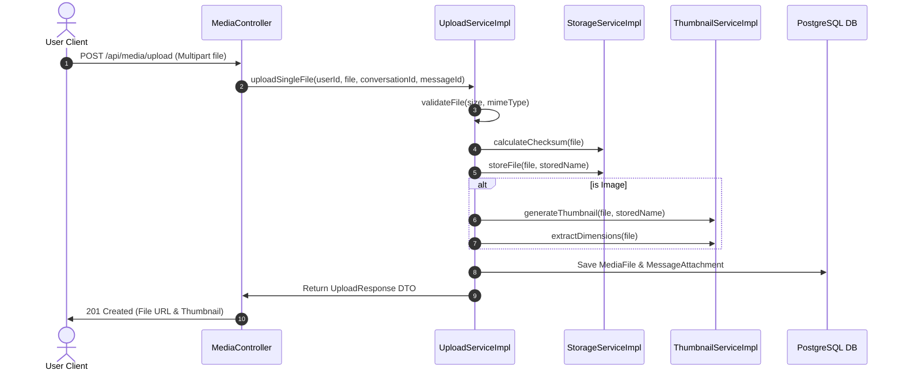

# ApexPay Module 18 – Media & File Sharing Platform Architecture

This document presents the detailed architectural specifications, ER diagrams, sequence diagrams, and class diagrams for Module 18: **Media & File Sharing Platform**.

---

## 1. Entity-Relationship (ER) Diagram

---

## 2. File Upload Sequence Diagram

