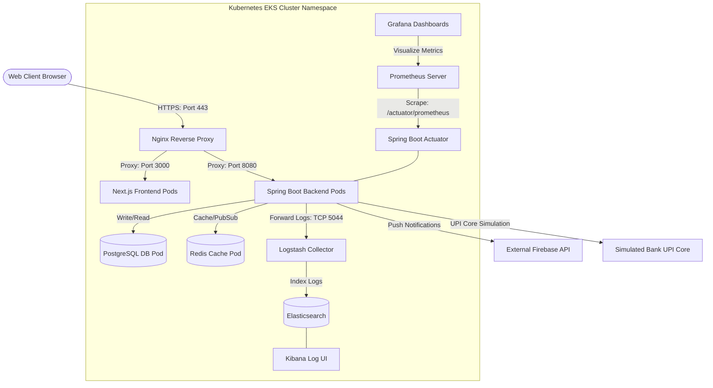

# System Architecture Diagram

This diagram displays the high-level server architecture and runtime components of the ApexPay platform, depicting how user traffic flows from HTTPS client browsers, through the Nginx reverse proxy, to the scaled Spring Boot backend instances, and down to the persistent database and memory storage layers.

